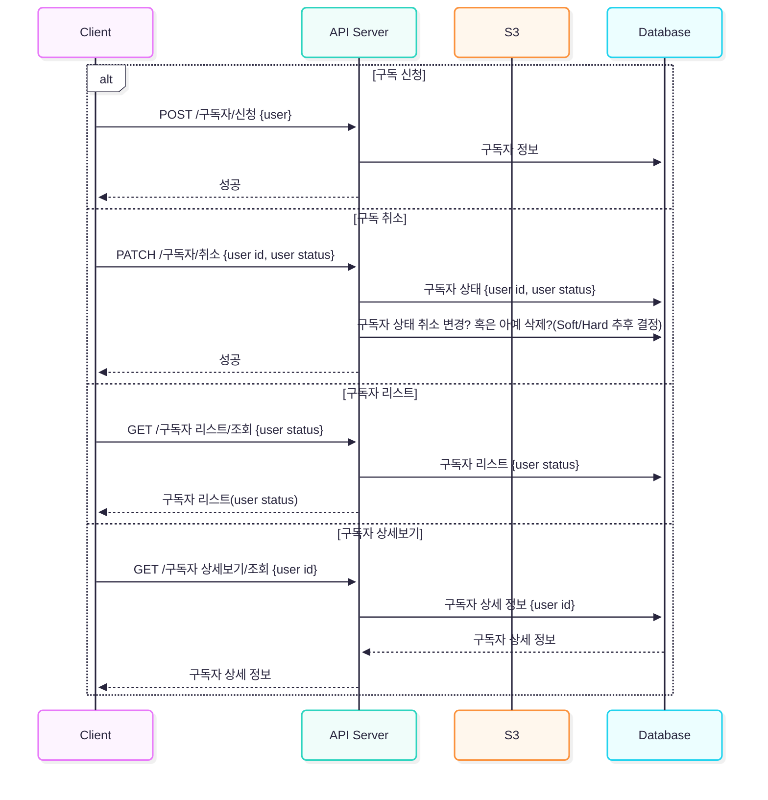

# 파쓰문서
https://d21p1u6w2ro5bb.cloudfront.net/

## 개발일지
https://ordinary-humidity-0ab.notion.site/268438ae842e81dc85bbfb8fe02c5e8c?v=268438ae842e810a8fa1000ccc6aa629&source=copy_link

```mermaid
---
config:
  theme: redux-color
  look: neo
---
sequenceDiagram
    %구독 서비스%
    participant Client
    participant API Server
    participant S3
    participant Database
    alt 구독 신청
        Client->>API Server: POST /구독자/신청 {user}
        API Server->>Database: 구독자 정보
        API Server-->>Client: 성공
    else 구독 취소
        Client->>API Server: PATCH /구독자/취소 {user id, user status}
        API Server->>Database: 구독자 상태 {user id, user status}
        API Server->>Database: 구독자 상태 취소 변경? 혹은 아예 삭제?(Soft/Hard 추후 결정)
        API Server-->>Client: 성공
    else 구독자 리스트
        Client->>API Server: GET /구독자 리스트/조회 {user status}
        API Server->>Database: 구독자 리스트 {user status}
        API Server-->>Client: 구독자 리스트(user status)
    else 구독자 상세보기
        Client->>API Server: GET /구독자 상세보기/조회 {user id}
        API Server->>Database: 구독자 상세 정보 {user id}
        Database-->>API Server: 구독자 상세 정보
        API Server-->>Client: 구독자 상세 정보
    end
```
